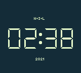

# DIGIT CLOCK

My first _working_ ROM built on Gameboy (other than "Hello world" :) )

This repo is part of [HomebrewOwl.GB](https://github.com/NotImplementedLife/HomebrewOwl.GB "HomebrewOwl") projects collection. You can download the latest release [here](https://github.com/NotImplementedLife/DIGIT-CLOCK/releases/download/1.0/DIGIT_CLOCK_1_0.gb).

## The idea

[Here](https://github.com/NotImplementedLife/Gameboy-ASM-Examples/tree/master/2.tiles) is specified how this project was born. Being part of the early learning process (meaning the time I used to confound tilesets with tilemaps), it may be full of mistakes and bad practices _(just like my other projects, of course)_. Currently, I did some minor fixes and made it follow Homebrew Owl's template (adapted from [ISSOtm's gb-boilerplate](https://github.com/ISSOtm/gb-boilerplate) - many thanks to him for learning me how to use that). I realised that the code runs faster with the original `vBlank` routine, therefore I kept it as it was instead of using the HbOwl's one.

## How to build

```
git clone https://github.com/NotImplementedLife/DIGIT-CLOCK --recursive
```
```
make
```
Make sure RGBDS is installed and exists in your `%PATH%`.

## How to play

`Stay & Watch`, if I were to paraphrase the [old famous Nintendo's handheld series](https://en.wikipedia.org/wiki/Game_%26_Watch "Who doesn't know about G&W?"). Seriously, the clock works on its own, you don't have to do anything but watch it.

## Screenshots

</img>
